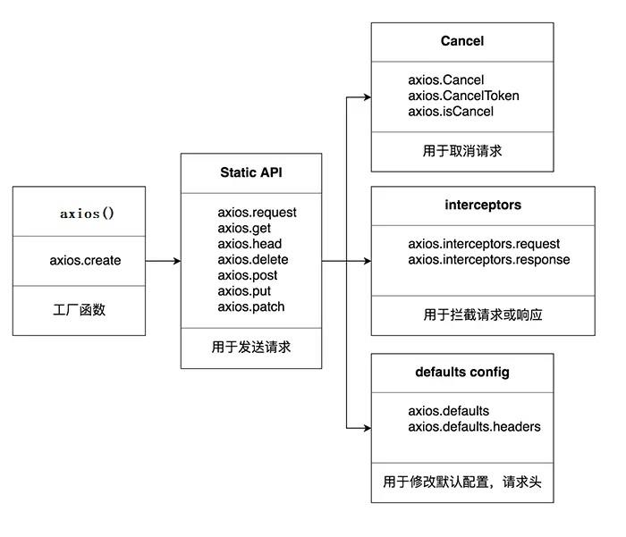
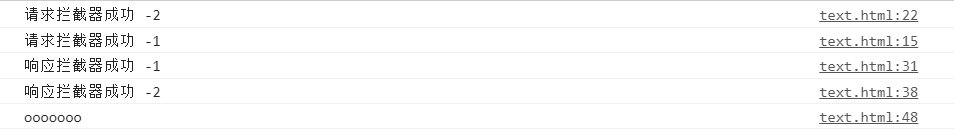

# [json-server](https://www.npmjs.com/package/json-server)

用来快速搭建REST API 的工具包


# [AXIOS]()

[axios/axios: Promise based HTTP client for the browser and node.js (github.com)](https://github.com/axios/axios)

##  XHR 的 ajax 封装特点

1. 函数的返回值为`promise`, 成功的结果为`response`, 失败的结果为`error`

2. 能处理多种类型的请求: GET/POST/PUT/DELETE

3. 函数的参数为一个配置对象

   ```js
   {
   	url: '', // 请求地址
   	method: '', // 请求方式GET/POST/PUT/DELETE
   	params: {}, // GET/DELETE 请求的 query 参数
   	data: {}, // POST/PUT 请求的请求体参数
   }
   ```

   ```js
   btn[1].onclick = function(){
   	axios({
   		//请求类型
   		method:'POST',	//可设置为GET、POST、PUT、delete
   		//URL
   		url:"http:127.0.0.1:3000/posts",
   		//请求体
   		data:{
   			"id": 3, 
   			"title": "json-server3", 
   			"author": "typicode" 
   		}
   	}).then(response=>{
   		console.log(response)
   	})
   }
   ```

4. 响应 json数据 自动解析为 js的对象/数组

## axios 特点

1. 基于 xhr + promise 的异步 ajax请求库
2. 浏览器端/node 端都可以使用
3. 支持请求／响应拦截器
4. 支持请求取消
5. 请求/响应数据转换
6. 批量发送多个请求


## 常用语法



### Request method aliases

> - axios(config): 通用/最本质的发任意类型请求的方式
> - axios(url[, config]): 可以只指定url 发get 请求
> - axios.request(config): 等同于axios(config)
> - axios.get(url[, config]): 发get 请求
> - axios.delete(url[, config]): 发delete 请求
> - axios.post(url[, data, config]): 发post 请求
> - axios.put(url[, data, config]): 发put 请求
> - axios.defaults.xxx: 请求的默认全局配置（method\baseURL\params\timeout…）
> - axios.interceptors.request.use(): 添加请求拦截器
> - axios.interceptors.response.use(): 添加响应拦截器
> - axios.create([config]): 创建一个新的axios(它没有下面的功能)
>
> - axios.Cancel(): 用于创建取消请求的错误对象
> - axios.CancelToken(): 用于创建取消请求的 token 对象
> - axios.isCancel(): 是否是一个取消请求的错误
> - axios.all(promises): 用于批量执行多个异步请求
> - axios.spread(): 用来指定接收所有成功数据的回调函数的方法
>


# axios 请求配置

Request Config(文档中)


# axios 默认配置

Config Defaults（文档中）

```js
//设置默认的请求类型为GET
axios.defaults.method = 'GET'
//设置基础 URL
axios.default.baseURL = 'http://127.0.0.1:3000'
```


# axios.create(config)

> 根据指定配置创建一个新的 axios, 也就是每个新 axios 都有自己的配置


新 axios 只是没有取消请求和批量发请求的方法, 其它所有语法都是一致的

为什么要设计这个语法?

1. 需求: 项目中有部分接口需要的配置与另一部分接口需要的配置不太一样, 如何处理（比如有多个baseURL需要指定）
2.  解决: 创建2 个新axios, 每个都有自己特有的配置, 分别应用到不同要求的接口请求中

```js
const instance = axios.create({ // instance是函数类型
	baseURL: 'http://localhost:3000'
})
// 使用instance发Ajax请求
instance({
	url: '/posts'
})
instance.get('/posts')
```


# 拦截器函数

Interceptors

> 流程: 请求拦截器2 => 请求拦截器1 => 发ajax 请求 => 响应拦截器1 => 响应拦截器2 => 请求的回调

注意: 此流程是通过 promise 串连起来的, 请求拦截器传递的是config, 响应拦截器传递的是response

```js
<script>
        // 添加请求拦截器
        axios.interceptors.request.use(function (config) {
            console.log('请求拦截器成功 -1')
            return config;
        }, function (error) {
            console.log('请求拦截器失败 -1')
            return Promise.reject(error);
        });
        axios.interceptors.request.use(function (config) {
            console.log('请求拦截器成功 -2')
            return config;
        }, function (error) {
            console.log('请求拦截器失败 -2')
            return Promise.reject(error);
        });

        // 添加响应拦截器
        axios.interceptors.response.use(function (response) {
            console.log('响应拦截器成功 -1')
            return response;
        }, function (error) {
            console.log('响应拦截器失败 -1')
            return Promise.reject(error);
        });
        axios.interceptors.response.use(function (response) {
            console.log('响应拦截器成功 -2')
            return response;
        }, function (error) {
            console.log('响应拦截器失败 -2')
            return Promise.reject(error);
        });
        axios({
            method: 'GET',
            url: 'http://127.0.0.1:3000/posts'
        }).then(response =>{
            console.log('ooooooo')
        }).catch(reason=>{
            console.log('aaaaaa')
        })
    </script>
```

拦截器结果：




# 取消请求

Cancellation

### 基本流程

1. 配置 `cancelToken` 对象的属性
2. 缓存用于取消请求的 `cancel` 函数
3. 在后面特定时机调用 `cancel` 函数取消请求
4. 在错误回调中判断如果 `error` 是 `cancel`, 做相应处理

