# Webpack从入门到精通-进阶篇

## vue 脚手架

vue create vue-project

- 通过` vue inspect --mode=development > webpack.dev.js`将vue开发环境配置打包一起放在webpack.dev.js文件下面，开发环境代码只需要研究webpack.dev.js文件即可
- 通过` vue inspect --mode=production > webpack.prod.js`将vue生产环境配置打包一起放在webpack.prod.js文件下面，生产环境代码只需要研究webpack.prod.js文件即可

开发环境文件webpack.dev.js 

生产环境文件webpack.prod.js

> （除了在css上面以及多线程打包上面进行了一些修改，其余和开发环境是一样的）

## 自定义loader

### loader基本介绍和使用

loader本质上是一个函数

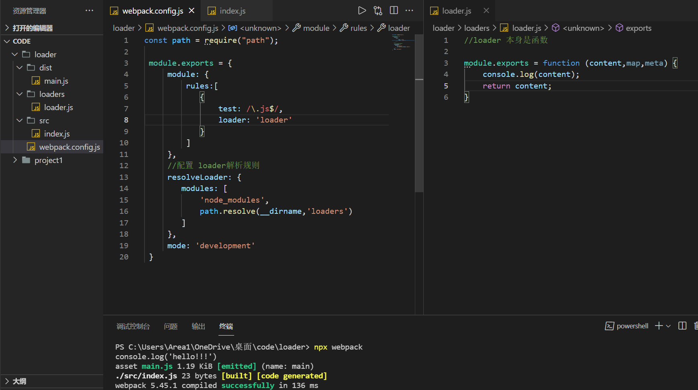


### loader执行顺序

1. loader的执行顺序在use数组里面是从下往上执行
2. loader里面有一个pitch方法，use数组中pitch方法的执行顺序是从上往下执行，因此我们如果想先执行某些功能，可以先在pitch方法中定义

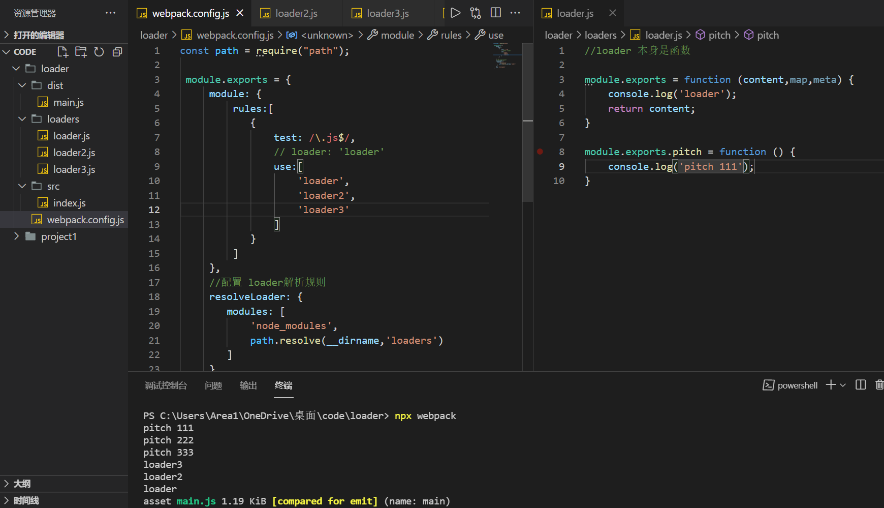


### 同步&异步 loader

1. 同步loader

```js
// 方式一
module.exports = function (content, map, meta) {
  console.log(111);

  return content;
}
// 方式二
module.exports = function (content, map, meta) {
  console.log(111);

  this.callback(null, content, map, meta);
}
```

2. 异步loader

>  使用`this.async()`方法会使整个loader停住,只有当你再次调用`callback`方法才会继续执行

```js
// 异步loader（推荐使用，loader在异步加载的过程中可以执行其余的步骤）
module.exports = function (content, map, meta) {
  console.log(222);

  const callback = this.async();

  setTimeout(() => {
    callback(null, content);
  }, 1000)
}
```


### 获取&检验 options

1. 获取options库

> 安装loader-utils：`cnpm install loader-utils -D` 在loader中引入并使用 

2. 校验options库

> 安装schema-utils：`npm i schema-utils`，在loader中从schema-utils引入validate并使用 

3. 在同目录下创建schema.json文件校验规则并引入使用

loader.js中代码

```js
// 1.1 获取options 引入
const {getOptions} = require('loader-utils');
// 2.1 获取validate（校验options是否合法）引入
const {validate} = require('schema-utils');

// 2.3创建schema.json文件校验规则并引入使用
const schema = require('./schema');

module.exports = function(content, map, meta) {
	// 1.2 获取options 使用
	const options = getOptions(this);

	console.log('loader', options);

	// 2.2校验options是否合法 使用
	validate(schema, options, {
		name: 'loader'
	})

	return content;
}
```

schema.json中代码

```json
{
	"type": "object",
	"properties": {
		"name": {
			"type": "string",
			"description": "名称～"
		}
	},
    // 如果设置为true表示除了校验前面写的string类型还可以追加校验其余类型
    //如果为false表示校验了string类型之后不可以再校验其余类型
	"additionalProperties": true
}
```

webpack.config.js中代码

```js
const path = require("path");

 module.exports = {
     module: {
         rules:[
            {
                test: /\.js$/,
                use:[
                    {
                        loader: 'loader',
                        // options部分
                        options: {
                            name: 'jack',
                            age: 18
                        }
                    },
                    'loader2',
                    'loader3'
                ],
                
            }
         ]
     },
    //配置 loader解析规则:我们的loader去哪个文件夹下面寻找（这里表示的是同级目录的loaders文件夹下面寻找）
    resolveLoader: {
     resolveLoader: {
        modules: [
            'node_modules',
            path.resolve(__dirname,'loaders')
        ]
     },
     mode: 'development'
 }
```


### 自定义babel-loader

1. 创建校验规则

babelSchema.json

```JS
{
  "type": "object",
  "properties": {
    "presets": {
      "type": "array"
    }
  },
  "addtionalProperties": true
}
```

2. 创建loader

babelLoader.js

```JS
const { getOptions } = require('loader-utils');
const { validate } = require('schema-utils');
const babel = require('@babel/core');
const util = require('util');

const babelSchema = require('./babelSchema.json');

// babel.transform用来编译代码的方法
// 是一个普通异步方法
// util.promisify将普通异步方法转化成基于promise的异步方法
const transform = util.promisify(babel.transform);

module.exports = function (content, map, meta) {
  // 获取loader的options配置
  const options = getOptions(this) || {};
  // 校验babel的options的配置
  validate(babelSchema, options, {
    name: 'Babel Loader'
  });

  // 创建异步
  const callback = this.async();

  // 使用babel编译代码
  transform(content, options)
    .then(({code, map}) => callback(null, code, map, meta))
    .catch((e) => callback(e))

}
```

3. babelLoader使用

webpack.config.js

```JS
const path = require('path');

module.exports = {
    module: {
      rules: [{
        test: /\.js$/,
        loader: 'babelLoader',
        options: {
          presets: [
            '@babel/preset-env'
          ]
        }
      }]
    },
   // 配置loader解析规则：我们的loader去哪个文件夹下面寻找（这里表示的是同级目录的loaders文件夹下面寻找）
    resolveLoader: {
      modules: [
        'node_modules',
        path.resolve(__dirname, 'loaders')
      ]
    }
  }
```


## 自定义plugin

### [tapable](https://github.com/webpack/tapable)

> 1. 安装tapable：npm install tapable -D
> 2. 初始化hooks容器 2.1 同步hooks，任务会依次执行:SyncHook、SyncBailHook 2.2 异步hooks，异步并行：AsyncParallelHook，异步串行：AsyncSeriesHook
> 3. 往hooks容器中注册事件/添加回调函数
> 4. 触发hooks
> 5. 启动文件：node tapable.test.js

文件tapable.test.js

```js
const { SyncHook, SyncBailHook, AsyncParallelHook, AsyncSeriesHook } = require('tapable');
```

SyncHook：

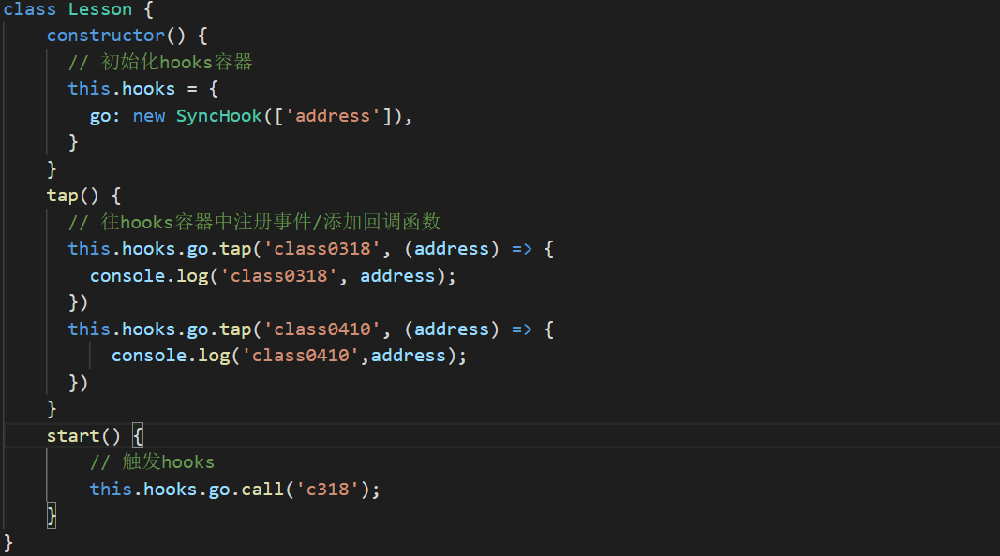

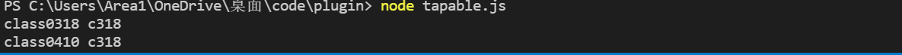

SyncBailHook：

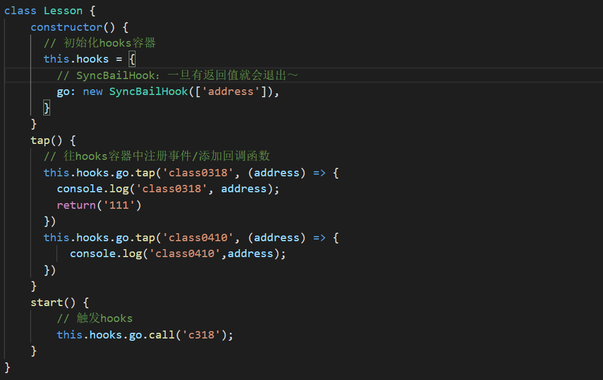


```js


class Lesson {
    constructor() {
      // 初始化hooks容器
      this.hooks = {
        // 同步hooks，任务会依次执行
        // go: new SyncHook(['address'])
        // SyncBailHook：一旦有返回值就会退出～
        go: new SyncBailHook(['address']),

        // 异步hooks
        // AsyncParallelHook：异步并行
        // leave: new AsyncParallelHook(['name', 'age']),
        // AsyncSeriesHook: 异步串行
        leave: new AsyncSeriesHook(['name', 'age'])
      }
    }
    tap() {
      // 往hooks容器中注册事件/添加回调函数
      this.hooks.go.tap('class0318', (address) => {
        console.log('class0318', address);
        return 111;
      })
      this.hooks.go.tap('class0410', (address) => {
        console.log('class0410', address);
      })

      // tapAsync常用，有回调函数
      this.hooks.leave.tapAsync('class0510', (name, age, cb) => {
        setTimeout(() => {
          console.log('class0510', name, age);
          cb();
        }, 2000)
      })
      // 需要返回promise
      this.hooks.leave.tapPromise('class0610', (name, age) => {
        return new Promise((resolve) => {
          setTimeout(() => {
            console.log('class0610', name, age);
            resolve();
          }, 1000)
        })
      })
}

start() {
  // 触发hooks
  this.hooks.go.call('c318');
  this.hooks.leave.callAsync('jack', 18, function () {
    // 代表所有leave容器中的函数触发完了，才触发
    console.log('end~~~');
  });
}
}
```

异步并行：

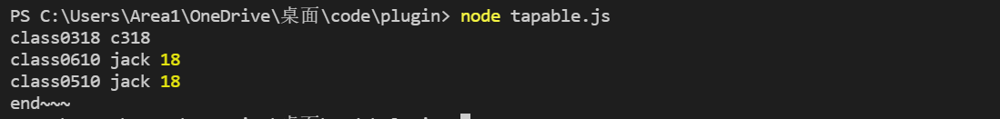

异步串行：

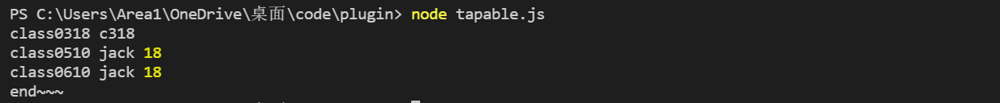

```js
const l = new Lesson();
l.tap();
l.start();
```


### [compiler钩子](https://www.webpackjs.com/api/compiler-hooks/)

1. 工作方式：异步串行执行
2. tapAsync和tapPromise表示异步
3. 这边只简单介绍了几个complier,具体开发的过程中可以根据文档介绍编写（很方便的）

webpack.config.js：

```js
const Plugin = require('./plugin/Plugin')

module.exports = {
    plugins: [
        new Plugin()
    ],
    mode: 'development'
}
```

Plugin1.js：

```JS
class Plugin1 {
  apply(complier) {

    complier.hooks.emit.tap('Plugin1', (compilation) => {
      console.log('emit.tap 111');
    })

    complier.hooks.emit.tapAsync('Plugin1', (compilation, cb) => {
      setTimeout(() => {
        console.log('emit.tapAsync 111');
        cb();
      }, 1000)
    })

    complier.hooks.emit.tapPromise('Plugin1', (compilation) => {
      return new Promise((resolve) => {
        setTimeout(() => {
          console.log('emit.tapPromise 111');
          resolve();
        }, 1000)
      })
    })

    complier.hooks.afterEmit.tap('Plugin1', (compilation) => {
      console.log('afterEmit.tap 111');
    })

    complier.hooks.done.tap('Plugin1', (stats) => {
      console.log('done.tap 111');
    })

  }
}

module.exports = Plugin1;
```

输出结果：

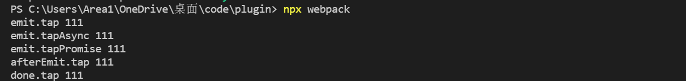


### [compilation钩子](https://www.webpackjs.com/api/compilation-hooks/)

#### 小插曲：nodejs环境中调试

1. package.json中输入(--inspect-brk 表示通过断点的方式调试，./node_modules/webpack/bin/webpack.js" 表示调试这个文件，node 表示通过node运行)

```JS
"scripts": {
    "start": "node --inspect-brk ./node_modules/webpack/bin/webpack.js"
  }
```

2. 在需要调试的地方打一个debugger

3. 通过node运行文件——`npm start`

4. 在一个网站中点击开发者工具，点击绿色图标

   

 便可以调试了，和在网页中调试代码一样的 

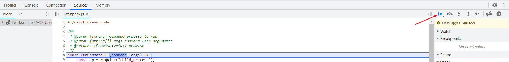

跳转到如下页面，可以查看 compilation 的相关属性和方法：

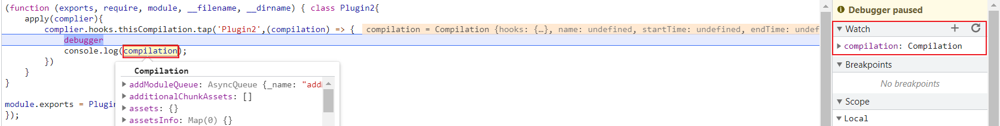

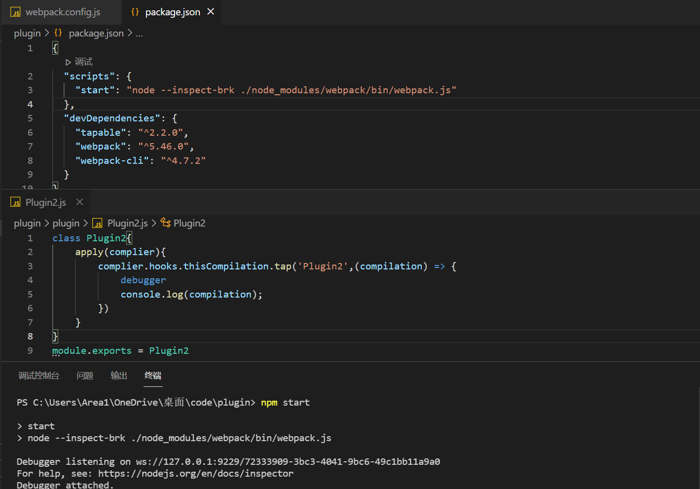


#### compilation钩子

1. 初始化compilation钩子

2. 往要输出资源中，添加一个a.txt文件

3. 存在一个b.txt ，读取b.txt中的内容，将b.txt中的内容添加到输出资源中的b.txt文件中 

   > - 读取b.txt中的内容需要使用node的readFile模块
   >
   > - 将b.txt中的内容添加到输出资源中的b.txt文件中除了使用 2 中的方法外，还有两种形式可以使用
   >
   >   > 1. 借助RawSource 
   >   > 2. 借助RawSource和emitAsset

```JS
const fs = require('fs');
const util = require('util');
const path = require('path');

const webpack = require('webpack');
const { RawSource } = webpack.sources;

// 将fs.readFile方法变成基于promise风格的异步方法
const readFile = util.promisify(fs.readFile);

class Plugin2 {

  apply(compiler) {
    // 1.初始化compilation钩子
    compiler.hooks.thisCompilation.tap('Plugin2', (compilation) => {
      // 添加资源
      compilation.hooks.additionalAssets.tapAsync('Plugin2', async (cb) => {
        // debugger
        // console.log(compilation);

        const content = 'hello plugin2';
          
        // 2.往要输出资源中，添加一个a.txt
        compilation.assets['a.txt'] = {
          // 文件大小
          size() {
            return content.length;
          },
          // 文件内容
          source() {
            return content;
          }
        }

        const data = await readFile(path.resolve(__dirname, 'b.txt'));

        // 3.2.1 compilation.assets['b.txt'] = new RawSource(data);
        // 以下是 3.2.1 的内容  
        compilation.emitAsset('b.txt', new RawSource(data));
        cb();

      })
    })
  }
}

module.exports = Plugin2;
```


### 自定义CopyWebpackPlugin

**CopyWebpackPlugin的功能**：将public文件夹中的文件复制到dist文件夹下面（忽略index.html文件）

1. 创建schema.json校验文件

```JS
{
  "type": "object",
  "properties": {
    "from": {
      "type": "string"
    },
    "to": {
      "type": "string"
    },
    "ignore": {
      "type": "array"
    }
  },
  "additionalProperties": false
}
```

2. 创建CopyWebpackPlugin.js插件文件

> 1. 下载schema-utils和globby：npm install globby schema-utils -D 
> 2. 将from中的资源复制到to中，输出出去 
> 3.  过滤掉ignore的文件 
> 4. 读取paths中所有资源 
> 5. 生成webpack格式的资源 
> 6. 添加compilation中，输出出去

```JS
const path = require('path');
const fs = require('fs');
const {promisify} = require('util')

const { validate } = require('schema-utils');
const globby = require('globby');// globby用来匹配文件目标
const webpack = require('webpack');

const schema = require('./schema.json');
const { Compilation } = require('webpack');

const readFile = promisify(fs.readFile);
const {RawSource} = webpack.sources

class CopyWebpackPlugin {
  constructor(options = {}) {
    // 验证options是否符合规范
    validate(schema, options, {
      name: 'CopyWebpackPlugin'
    })

    this.options = options;
  }
  apply(compiler) {
    // 初始化compilation
    compiler.hooks.thisCompilation.tap('CopyWebpackPlugin', (compilation) => {
      // 添加资源的hooks
      compilation.hooks.additionalAssets.tapAsync('CopyWebpackPlugin', async (cb) => {
        // 将from中的资源复制到to中，输出出去
        const { from, ignore } = this.options;
        const to = this.options.to ? this.options.to : '.';
        //1. 读取 from 中的资源
          
        // context就是webpack配置
        // 运行指令的目录
        const context = compiler.options.context; // process.cwd()
        // 将输入路径变成绝对路径
        const absoluteFrom = path.isAbsolute(from) ? from : path.resolve(context, from);

        // 1. 过滤掉ignore的文件
        // globby(要处理的文件夹，options)
        const paths = await globby(absoluteFrom, { ignore });

        console.log(paths); // 所有要加载的文件路径数组

        // 2. 读取paths中所有资源
        const files = await Promise.all(
          paths.map(async (absolutePath) => {
            // 读取文件
            const data = await readFile(absolutePath);
            // basename得到最后的文件名称
            const relativePath = path.basename(absolutePath);
            // 和to属性结合
            // 没有to --> reset.css
            // 有to --> css/reset.css(对应webpack.config.js中CopyWebpackPlugin插件的to的名称css)
            const filename = path.join(to, relativePath);

            return {
              // 文件数据
              data,
              // 文件名称
              filename
            }
          })
        )

        // 3. 生成webpack格式的资源
        const assets = files.map((file) => {
          const source = new RawSource(file.data);
          return {
            source,
            filename: file.filename
          }
        })
        
        // 4. 添加compilation中，输出出去
        assets.forEach((asset) => {
          compilation.emitAsset(asset.filename, asset.source);
        })

        cb();
      })
    })
  }
}

module.exports = CopyWebpackPlugin;
```

3. 在webpack.config.js中使用

```js
const CopyWebpackPlugin = require('./plugin/CopyWebpackPlugin')

module.exports = {
    plugins: [
        // new Plugin(),
        new CopyWebpackPlugin({
            form: 'public',
            ignore: ['**/index.html']
        })
    ],
    mode: 'development'
}
```


## 自定义Webpack

### Webpack 执行流程

1. 初始化 Compiler：webpack(config) 得到 Compiler 对象
2. 开始编译：调用 Compiler 对象 run 方法开始执行编译
3. 确定入口：根据配置中的 entry 找出所有的入口文件。
4. 编译模块：从入口文件出发，调用所有配置的 Loader 对模块进行编译，再找出该模块依赖的模块，递归直到所有模块被加载进来
5. 完成模块编译： 在经过第 4 步使用 Loader 编译完所有模块后，得到了每个模块被编译后的最终内容以及它们之间的依赖关系。
6. 输出资源：根据入口和模块之间的依赖关系，组装成一个个包含多个模块的 Chunk，再把每个 Chunk 转换成一个单独的文件加入到输出列表。（注意：这步是可以修改输出内容的最后机会）
7. 输出完成：在确定好输出内容后，根据配置确定输出的路径和文件名，把文件内容写入到文件系统

### 准备工作

1. 创建如下目录

   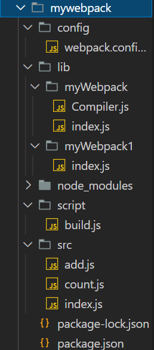

2. src文件夹中对应的 js 代码

   add.js

   ```js
   function add(x,y){
       return x + y;
   }
   
   export default add;
   ```

   count.js

   ```js
   function count(x,y){
       return x - y ;
   }
   
   export default count
   ```

   index.js

   ```js
   import add from './add'
   import count from './count'
   
   console.log(add(1,2));
   console.log(count(3,1));
   ```

3. webpack.config.js 

   ```js
   const path = require('path')
   
   module.exports = {
       entry: '../src/index.js',
       output: {
           path: path.resolve(__dirname,'../dist'),
           filename: 'main.js'
       }
   }
   ```

4. build.js

   > 将lib文件夹下的myWebpack核心代码和config文件下的webpack基础配置引入并调用run()函数开始打包

   ```js
   const myWebpack = require('../lib/myWebpack')
   const config = require('../config/webpack.config')
   
   const compiler = myWebpack(config)
   //开始打包webpack
   compiler.run()
   ```

5. 为了方便启动，控制台通过输入命令 `npm init -y`拉取出package.json文件

   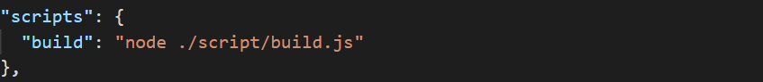

   > 终端命令`npm run build`时会运行/script/build.js文

6. 如果需要断点调试:在scripts中添加`"debug": "node --inspect-brk ./script/build.js"`表示通过在终端输入命令`npm run debug`时会调试/script/build.js文件中的代码


### 使用babel解析文件

1. 下载三个babel包—— [babel官网](https://www.babeljs.cn/docs/babel-core)

> - `npm install @babel/parser -D`用来将代码解析成ast抽象语法树 
> - `npm install @babel/traverse -D`用来遍历ast抽象语法树代码 
> - `npm install @babel/core-D`用来将代码中浏览器不能识别的语法进行编译

2. 编码思路
   1.  读取入口文件内容
   2. 将其解析成ast抽象语法树 
   3. 收集依赖 
   4. 编译代码：将代码中浏览器不能识别的语法进行编译

index.js(lib-->myWebpack-->index.js)

```JS
const fs = require('fs');
const path = require('path');

// babel的库
const babelParser = require('@babel/parser');
const traverse = require('@babel/traverse').default;
const { transformFromAst } = require('@babel/core');

function myWebpack(config) {
  return new Compiler(config);
}

class Compiler {
  constructor(options = {}) {
    this.options = options;
  }
  // 启动webpack打包
  run() {
    // 1. 读取入口文件内容
    // 入口文件路径
    const filePath = this.options.entry;
    const file = fs.readFileSync(filePath, 'utf-8');
    // 2. 将其解析成ast抽象语法树
    const ast = babelParser.parse(file, {
      sourceType: 'module' // 解析文件的模块化方案是 ES Module
    })
    // debugger;
    console.log(ast);

    // 获取到文件文件夹路径
    const dirname = path.dirname(filePath);

    // 定义存储依赖的容器
    const deps = {}

    // 3. 收集依赖
    traverse(ast, {
      // 内部会遍历ast中program.body，判断里面语句类型
      // 如果 type：ImportDeclaration 就会触发当前函数
      ImportDeclaration({node}) {
        // 文件相对路径：'./add.js'
        const relativePath = node.source.value;
        // 生成基于入口文件的绝对路径
        const absolutePath = path.resolve(dirname, relativePath);
        // 添加依赖
        deps[relativePath] = absolutePath;
      }
    })

    console.log(deps);

    // 4. 编译代码：将代码中浏览器不能识别的语法进行编译
    const { code } = transformFromAst(ast, null, {
      presets: ['@babel/preset-env']
    })

    console.log(code);
  }
}

module.exports = myWebpack;
```


### 封装模块化

我们开发代码过程中讲究的是模块化开发，不同功能的代码放在不同的文件中 

> 创建myWebpack2-->parser.js（放入解析代码）/Compiler.js（放入编译代码）/index.js（主文件）

### 收集所有的依赖

所有代码位于myWebpack文件夹中 Compiler.js文件中

1. build函数用于构建代码，
2. run函数中modules通过递归遍历收集所有的依赖，
3. depsGraph用于将依赖整理更好依赖关系图

### 生成打包之后的bundle

> 代码位于myWebpack-->Compiler.js中的bundle部分 

整个myWebpack-->Compiler.js代码

```JS
const path = require('path');
const fs = require('fs');
const {
  getAst,
  getDeps,
  getCode
} = require('./parser')

class Compiler {
  constructor(options = {}) {
      // webpack配置对象
      this.options = options;
      // 所有依赖的容器
      this.modules = [];
    }
    // 启动webpack打包
  run() {
    // 入口文件路径
    const filePath = this.options.entry;

    // 第一次构建，得到入口文件的信息
    const fileInfo = this.build(filePath);

    this.modules.push(fileInfo);

    // 遍历所有的依赖
    this.modules.forEach((fileInfo) => {
      /**
       {
          './add.js': '/Users/xiongjian/Desktop/atguigu/code/05.myWebpack/src/add.js',
          './count.js': '/Users/xiongjian/Desktop/atguigu/code/05.myWebpack/src/count.js'
        } 
       */
      // 取出当前文件的所有依赖
      const deps = fileInfo.deps;
      // 遍历
      for (const relativePath in deps) {
        // 依赖文件的绝对路径
        const absolutePath = deps[relativePath];
        // 对依赖文件进行处理
        const fileInfo = this.build(absolutePath);
        // 将处理后的结果添加modules中，后面遍历就会遍历它了～（递归遍历）
        this.modules.push(fileInfo);
      }

    })

    console.log(this.modules);

    // 将依赖整理更好依赖关系图
    /*
      {
        'index.js': {
          code: 'xxx',
          deps: { 'add.js': "xxx" }
        },
        'add.js': {
          code: 'xxx',
          deps: {}
        }
      }
    */
    const depsGraph = this.modules.reduce((graph, module) => {
      return {
        ...graph,
        [module.filePath]: {
          code: module.code,
          deps: module.deps
        }
      }
    }, {})

    console.log(depsGraph);

    this.generate(depsGraph)

  }

  // 开始构建
  build(filePath) {
    // 1. 将文件解析成ast
    const ast = getAst(filePath);
    // 2. 获取ast中所有的依赖
    const deps = getDeps(ast, filePath);
    // 3. 将ast解析成code
    const code = getCode(ast);

    return {
      // 文件路径
      filePath,
      // 当前文件的所有依赖
      deps,
      // 当前文件解析后的代码
      code
    }
  }

  // 生成输出资源
  generate(depsGraph) {

    /* index.js的代码
      "use strict";\n' +
      '\n' +
      'var _add = _interopRequireDefault(require("./add.js"));\n' +
      '\n' +
      'var _count = _interopRequireDefault(require("./count.js"));\n' +
      '\n' +
      'function _interopRequireDefault(obj) { return obj && obj.__esModule ? obj : { "default": obj }; }\n' +
      '\n' +
      'console.log((0, _add["default"])(1, 2));\n' +
      'console.log((0, _count["default"])(3, 1));
    */

    const bundle = `
      (function (depsGraph) {
        // require目的：为了加载入口文件
        function require(module) {
          // 定义模块内部的require函数
          function localRequire(relativePath) {
            // 为了找到要引入模块的绝对路径，通过require加载
            return require(depsGraph[module].deps[relativePath]);
          }
          // 定义暴露对象（将来我们模块要暴露的内容）
          var exports = {};

          (function (require, exports, code) {
            eval(code);
          })(localRequire, exports, depsGraph[module].code);
          
          // 作为require函数的返回值返回出去
          // 后面的require函数能得到暴露的内容
          return exports;
        }
        // 加载入口文件
        require('${this.options.entry}');

      })(${JSON.stringify(depsGraph)})
    `
      // 生成输出文件的绝对路径
    const filePath = path.resolve(this.options.output.path, this.options.output.filename)
      // 写入文件
    fs.writeFileSync(filePath, bundle, 'utf-8');
  }
}

module.exports = Compiler;
```

